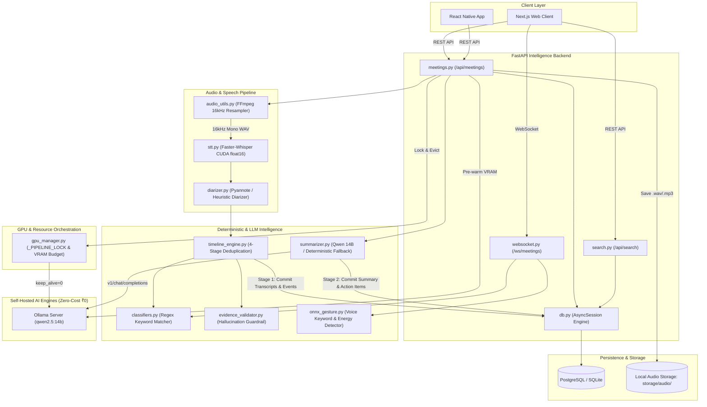
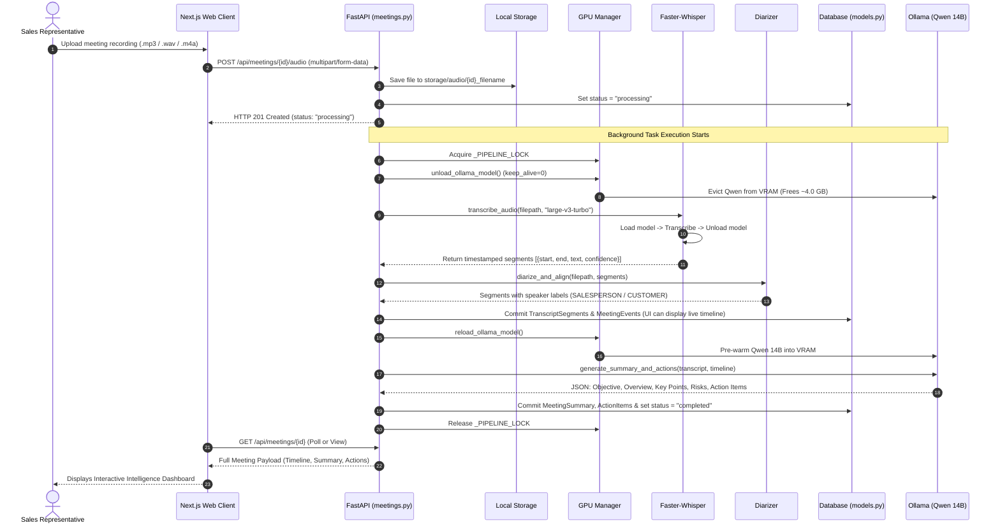
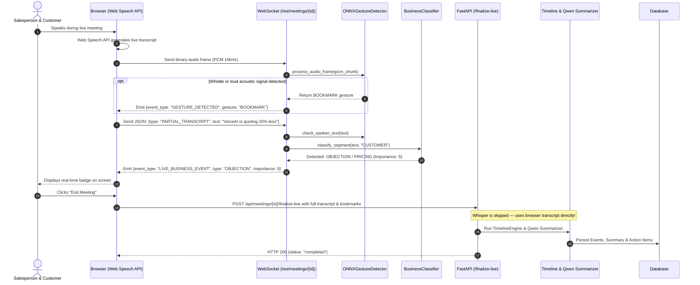
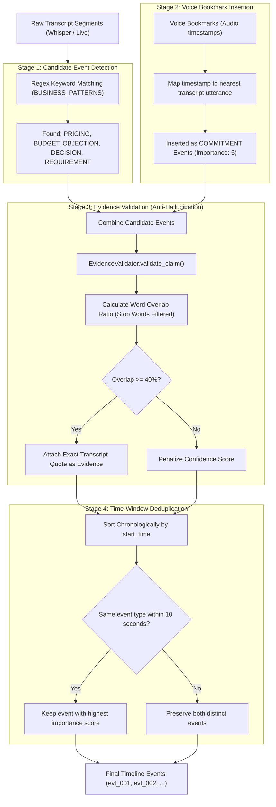
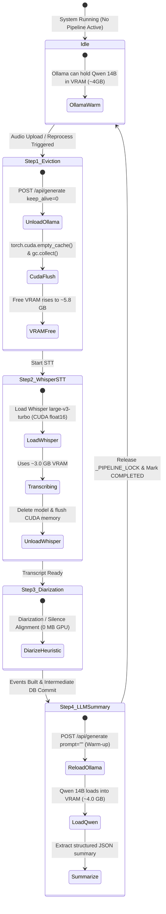

# SSMI (Smart Sales Meeting Intelligence) — Complete Codebase & System Guide

---

## 1. Executive Summary

**SSMI (Smart Sales Meeting Intelligence)** is an AI-powered sales intelligence platform designed to process both pre-recorded audio meetings and live browser conversations.

The platform automatically:
1. **Transcribes** audio with high accuracy using local Whisper models.
2. **Identifies speakers** (Salesperson vs. Customer) through neural or heuristic diarization.
3. **Extracts business-critical events** (pricing discussions, budget limits, feature requirements, competitor mentions, objections, agreements).
4. **Validates claims** against transcript quotes to prevent AI hallucinations.
5. **Generates structured intelligence** (executive summaries, next steps, action items with owners and deadlines).
6. **Drafts follow-up emails** ready to send to clients.
7. **Maintains ₹0 external API costs** by running open-source models (Faster-Whisper, Qwen 2.5 14B via Ollama) locally on consumer GPUs (e.g., NVIDIA RTX 4050 6GB).

---

## 2. File-by-File Breakdown

```
SSMI/
├── services/
│   ├── api/
│   │   └── fastapi/
│   │       ├── main.py                  # Application entry point & lifespan manager
│   │       ├── routing.py               # Custom APIRoute for camelCase serialization
│   │       ├── schemas.py               # Pydantic request/response models
│   │       ├── database/
│   │       │   ├── db.py                # Database connection & async session management
│   │       │   └── models.py            # SQLAlchemy ORM table definitions & enums
│   │       └── routers/
│   │           ├── meetings.py          # Core meetings CRUD, audio upload & AI pipeline
│   │           ├── search.py            # Keyword & event search across meetings
│   │           └── websocket.py         # Real-time WebSocket streaming & live gestures
│   ├── gpu_manager.py                   # GPU VRAM scheduling, locks & model eviction
│   ├── transcription/
│   │   ├── stt.py                       # Faster-Whisper Speech-to-Text inference engine
│   │   └── audio_utils.py               # FFmpeg audio conversion & resampling utilities
│   ├── diarization/
│   │   └── diarizer.py                  # Pyannote neural & heuristic speaker diarization
│   ├── intelligence/
│   │   ├── classifiers.py               # Regex/keyword business event detector
│   │   ├── evidence_validator.py        # Claim-transcript keyword overlap validator
│   │   └── timeline_engine.py           # 4-stage meeting timeline generation engine
│   ├── summarization/
│   │   └── summarizer.py                # Qwen 14B LLM summarizer & follow-up email generator
│   └── gesture/
│       └── onnx_gesture.py              # Spoken keyword & audio energy gesture detector
├── scripts/
│   └── reprocess_meeting.py             # Standalone CLI tool to re-run pipeline on audio
├── tests/
│   ├── test_api.py                      # Integration tests for FastAPI endpoints
│   ├── test_pipeline.py                 # Unit tests for intelligence and timeline generation
│   └── test_stt.py                      # Tests for Whisper STT error handling & VRAM fallback
├── start-backend.bat                    # Windows startup script for the backend server
├── pyproject.toml                       # Python project configuration & pytest settings
└── .env                                 # Environment variables and configuration
```

---

### Detailed File Descriptions

#### `services/api/fastapi/main.py`
- **Purpose**: Application entry point and lifespan orchestrator.
- **Key Functions**:
  - `lifespan(app)`: Runs at startup to check `faster-whisper` and `ffmpeg` installations, then initializes the database tables.
  - `health_check()`: `GET /health` endpoint returning system health, runtime flags, and zero-cost status.
- **Dependencies**: Mounts `meetings`, `search`, and `websocket` routers; enables CORS middleware for frontend communication.

#### `services/api/fastapi/routing.py`
- **Purpose**: Response serialization standardization.
- **Key Classes**:
  - `CamelCaseAPIRoute`: Overrides FastAPI's default serialization to ensure JSON responses use camelCase keys (e.g., `customerName`, `startTime`) matching frontend TypeScript contracts.

#### `services/api/fastapi/schemas.py`
- **Purpose**: Data contract definitions (Pydantic models).
- **Key Models**:
  - `MeetingCreateSchema`: Input for creating a meeting session.
  - `MeetingResponseSchema`: Complete meeting payload including nested transcript, events, summary, and action items.
  - `FinalizeLiveMeetingSchema`: Input for finalizing a browser-recorded meeting.
  - `FollowUpEmailSchema`: Output model for AI-generated follow-up emails.
  - `DashboardStatsSchema`: Metrics for the overview dashboard.

#### `services/api/fastapi/database/db.py`
- **Purpose**: Database engine and session lifecycle management.
- **Key Components**:
  - `engine` & `async_sessionmaker`: Configured with connection pooling.
  - `init_db()`: Initializes PostgreSQL with `pgvector` if `DATABASE_URL` is set, or falls back to local SQLite (`ssmi_local.db`).
  - `get_db()`: Async generator yielding database sessions with automatic rollback on error.

#### `services/api/fastapi/database/models.py`
- **Purpose**: SQLAlchemy ORM schema definitions.
- **Key Tables**:
  - `Meeting`: Master meeting record (status, customer info, duration, sentiment, purchase intent).
  - `TranscriptSegment`: Individual timestamped utterances with speaker labels.
  - `MeetingEvent`: Detected timeline milestones (pricing, objections, decisions).
  - `ActionItem`: Follow-up tasks with owners, deadlines, and priorities.
  - `MeetingSummary`: AI-generated objective, overview, key points, risks, and next steps.
  - `SafeVector`: Cross-compatible vector column (PostgreSQL `pgvector` or SQLite `JSON`).

#### `services/api/fastapi/routers/meetings.py`
- **Purpose**: The central controller for all meeting lifecycle actions and AI orchestration.
- **Key Endpoints**:
  - `POST /api/meetings`: Create a new meeting.
  - `POST /api/meetings/{id}/audio`: Upload audio and trigger the background AI pipeline.
  - `POST /api/meetings/{id}/finalize-live`: Process live browser transcripts (skips Whisper).
  - `POST /api/meetings/{id}/follow-up-email`: Generate a follow-up email draft.
  - `GET /api/meetings/{id}/audio`: Stream audio recording with HTTP Range support.
  - `POST /api/meetings/{id}/cancel`: Gracefully cancel an ongoing pipeline run.

#### `services/api/fastapi/routers/search.py`
- **Purpose**: Global meeting intelligence search.
- **Key Endpoints**:
  - `GET /api/search`: Performs indexed multi-field search across meeting titles, customer companies, event descriptions, and transcript evidence, sorted by importance.

#### `services/api/fastapi/routers/websocket.py`
- **Purpose**: Real-time two-way communication for live meetings.
- **Key Components**:
  - `ConnectionManager`: Manages active WebSocket connections per meeting ID.
  - `meeting_websocket_endpoint`: Receives binary PCM audio chunks (for gesture cues) and partial transcript text (for live event alerts).

#### `services/gpu_manager.py`
- **Purpose**: GPU VRAM budget orchestrator and concurrency lock.
- **Key Components**:
  - `_PIPELINE_LOCK`: Global mutex ensuring heavy AI models do not run concurrently and exhaust VRAM.
  - `unload_ollama_model()`: Evicts Qwen from VRAM before Whisper runs.
  - `reload_ollama_model()`: Pre-warms Qwen into VRAM before summarization.
  - `flush_cuda()`: Clears PyTorch CUDA memory caches and forces Python garbage collection.

#### `services/transcription/stt.py`
- **Purpose**: Local speech-to-text transcription engine.
- **Key Features**:
  - `transcribe_audio()`: Executes Whisper on GPU (`float16`) or CPU (`int8`).
  - `pick_model_for_vram()`: Automatically selects a smaller model if available VRAM is low.
  - `merge_duplicate_segments()`: Removes Whisper tail repetition artifacts.

#### `services/transcription/audio_utils.py`
- **Purpose**: Audio format standardization.
- **Key Functions**:
  - `prepare_audio_for_whisper()`: Converts WebM, Opus, OGG, and M4A audio to 16kHz 16-bit mono WAV using FFmpeg.
  - `ffmpeg_available()`: Detects system FFmpeg or bundled `imageio-ffmpeg`.

#### `services/diarization/diarizer.py`
- **Purpose**: Speaker segmentation (who spoke when).
- **Key Modes**:
  - Neural Mode: Uses `pyannote/speaker-diarization-3.1` when a Hugging Face token is provided.
  - Heuristic Mode: Fast, rule-based fallback that alternates speakers on silence pauses ≥ 1.5 seconds.

#### `services/intelligence/classifiers.py`
- **Purpose**: Fast, deterministic business signal classification.
- **Key Functions**:
  - `BusinessEventClassifier.classify_segment()`: Matches regex patterns to categorize utterances into `REQUIREMENT`, `PRICING`, `BUDGET`, `OBJECTION`, `NEGOTIATION`, or `DECISION`.

#### `services/intelligence/evidence_validator.py`
- **Purpose**: AI hallucination prevention.
- **Key Functions**:
  - `EvidenceValidator.validate_claim()`: Computes keyword overlap ratio between generated claims and raw transcript segments, penalizing unsupported extractions.

#### `services/intelligence/timeline_engine.py`
- **Purpose**: 4-stage meeting timeline generation.
- **Key Steps**:
  1. Detect candidate events.
  2. Integrate voice bookmarks.
  3. Validate against transcript evidence.
  4. Deduplicate overlapping events within 10-second windows.

#### `services/summarization/summarizer.py`
- **Purpose**: Structured meeting summarization and email generation.
- **Key Features**:
  - Calls Qwen 2.5 14B via local Ollama API (`/v1/chat/completions`).
  - Includes a zero-dependency deterministic fallback if Ollama is not running.

#### `services/gesture/onnx_gesture.py`
- **Purpose**: Spoken voice keyword detection ("Bookmark", "Stop Meeting") and high-energy audio frame analysis.

#### `scripts/reprocess_meeting.py`
- **Purpose**: CLI maintenance utility to re-run the full AI pipeline on an existing meeting using its stored audio file.

---

## 3. Component Integration & Architecture

### System Integration Map


---

## 4. End-to-End Workflow & Sequence Diagrams

### Flow 1: Pre-Recorded Audio Upload & Background AI Pipeline Workflow



---

### Flow 2: Live Browser Meeting & Real-Time Gesture Workflow



---

### Flow 3: 4-Stage Intelligence & Timeline Generation Pipeline



---

### Flow 4: GPU Memory Lifecycle State Machine (RTX 4050 6GB)



---

## 5. Primary Use Cases & Business Value

1. **Automated Post-Meeting Intelligence**: Upload a call recording to automatically receive categorized milestones, decisions, objections, and assigned action items without manual note-taking.
2. **Real-Time Meeting Co-Pilot**: Receive instant alerts during live calls when pricing objections or competitor mentions occur, and use spoken/acoustic bookmarks to mark key moments.
3. **Automated Client Follow-Up**: Generate polished follow-up email drafts referencing agreed deadlines and deliverables with one click.
4. **Cross-Meeting Search**: Instantly query across historical client meetings for specific feature requests, pricing commitments, or objections.

---

## 6. GPU & VRAM Budget (6 GB RTX 4050)

To avoid CUDA Out-Of-Memory (OOM) errors on 6GB GPUs, models are executed sequentially:

| Stage | Active Model | VRAM Usage | Available Headroom |
|---|---|---|---|
| **1. Audio Transcription** | Whisper Large-v3-Turbo | ~3.0 GB | ~3.0 GB |
| **2. Diarization** | Pyannote / Heuristic | ~0.0–1.5 GB | ~4.5 GB |
| **3. Summarization** | Qwen 2.5 14B (4-bit) | ~4.0 GB | ~2.0 GB |

---

## 7. Execution & Setup Guide

### 1. Prerequisites
- Python 3.10+ (Python 3.11/3.12 recommended)
- FFmpeg installed or available via `imageio-ffmpeg`
- Ollama running locally with `qwen2.5:14b` (optional, fallback included)

### 2. Environment Configuration (`.env`)
```ini
# Database (leave blank to default to SQLite)
DATABASE_URL=

# LLM Configuration
VLLM_ENDPOINT=http://localhost:11434/v1
VLLM_MODEL_NAME=qwen2.5:14b

# Whisper Configuration
WHISPER_MODEL_NAME=large-v3-turbo
WHISPER_FAST_MODEL=small
USE_CUDA=true

# Diarization (Optional)
ENABLE_DIARIZATION=false
HUGGINGFACE_TOKEN=
```

### 3. Starting the Backend
Using the provided batch script:
```cmd
start-backend.bat
```
Or manually via terminal:
```bash
.venv\Scripts\python.exe -m uvicorn services.api.fastapi.main:app --host 0.0.0.0 --port 8000 --reload
```

### 4. Running the Tests
```bash
.venv\Scripts\python.exe -m pytest tests/ -v
```

### 5. Reprocessing a Meeting via CLI
```bash
.venv\Scripts\python.exe -m scripts.reprocess_meeting meeting_88f81fae
```
